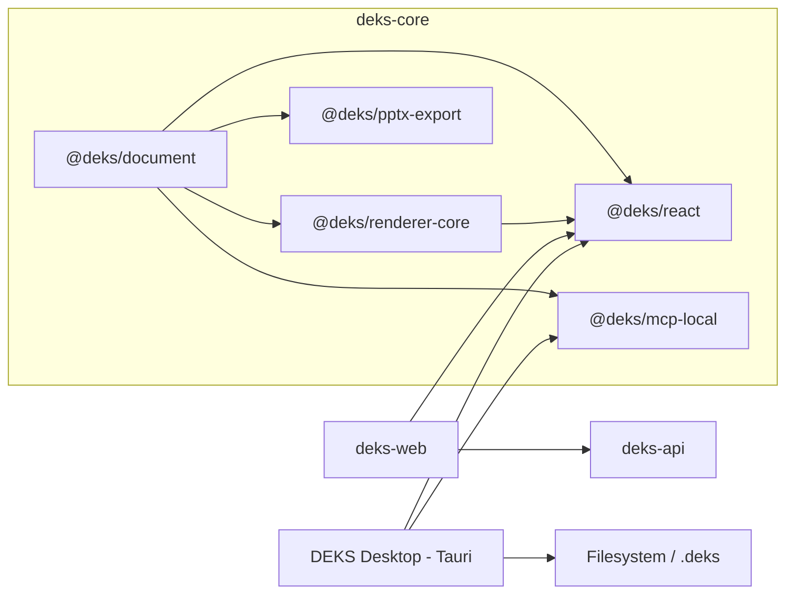

# Arquitectura objetivo

## Decisión

DEKS Core será una librería local-first y portable. Los hosts aportan persistencia, identidad,
permisos, red y capacidades del sistema operativo; el núcleo aporta documento, edición, render,
presentación y exportación.



## Qué sí pertenece al núcleo

- Documento portable y validación exhaustiva.
- Comandos deterministas, historial local y undo/redo.
- Canvas, renderer, transiciones y medición de layout.
- Editor React sin transporte obligatorio.
- Reproductor React embebido o inmersivo.
- Exportación/importación `.deks` y `.deks.json` de desarrollo.
- Elementos semánticos, incluido el botón de enlace externo.
- Interfaces para resolver assets y abrir URLs sin asumir navegador o Tauri.

## Qué permanece fuera

| Responsabilidad | Dueño |
|---|---|
| Login, sesiones, OAuth y CSRF | `deks-web` + `deks-api` |
| Workspaces, roles, planes y cuotas | `deks-api` |
| Publicación por link y copias Cloud | `deks-api` |
| Routing, landing y shell de cuenta | `deks-web` |
| R2, Postgres, Postmark y observabilidad | Infraestructura Cloud |
| Ventanas, actualizaciones y permisos OS | futura app Tauri |

## Componentes públicos

### `DeksEditor`

Controla edición, selección e inspector. Recibe un documento y handlers; no conoce REST ni cookies.
El host puede usar almacenamiento local, un adaptador Cloud o el filesystem de Tauri.

### `DeksPresenter`

Reproduce un documento de sólo lectura.

```ts
interface DeksPresenterProps {
  document: DeksDocument;
  variant?: "embedded" | "immersive";
  initialSlideId?: string;
  extraControls?: React.ReactNode;
  onExit?: () => void;
  onOpenExternal?: (url: HttpsUrl) => void | Promise<void>;
}
```

`extraControls` pertenece al host: DEKS Cloud puede mostrar “Editar copia” y “Guardar copia”; un
embed puede omitirlos; Tauri puede agregar controles nativos. El canvas y la navegación base siguen
siendo propiedad del componente.

### Fullscreen

Hay dos conceptos explícitos:

1. `immersive`: layout dentro de la pestaña o ventana, permitido al cargar.
2. `native fullscreen`: Fullscreen API del navegador, solicitado sólo desde un gesto.

El componente puede exponer `requestFullscreen()` mediante un handle, pero no debe activarlo al
montarse ni confundir su salida con abandonar el modo inmersivo.

## Enlaces externos

El elemento `link-button` tiene contenido y estilo editable, pero una acción simple: abrir una URL
`https:`. En edición, un clic selecciona el elemento. En presentación, el renderer delega en
`onOpenExternal`; no llama APIs de plataforma por su cuenta.

- Web: nueva pestaña con `noopener,noreferrer`.
- Tauri: plugin `opener`/shell con allowlist y confirmación del host.
- Exportación PPTX: hyperlink nativo cuando el formato lo permita.
- Esquemas `javascript:`, `data:`, `file:` y URLs relativas son inválidos.

## MCP local para Tauri

La app desktop será dueña de los archivos y levantará un MCP local opcional sobre los mismos
comandos de `@deks/document`.

- Transporte preferido: `stdio` cuando el cliente lo soporte; loopback sólo con token de capacidad.
- Sin cuenta ni conexión Cloud para operar archivos locales.
- Acceso limitado a carpetas elegidas por el usuario.
- Escrituras atómicas, locks por archivo y backup recuperable.
- Assets por hash dentro del `.deks`; nunca rutas arbitrarias entregadas por el modelo.
- Tools de lectura/escritura tipadas, revisión vigente y errores estructurados.

El MCP no importa React ni Tauri. Tauri administra lifecycle, permisos y registro con los clientes.

